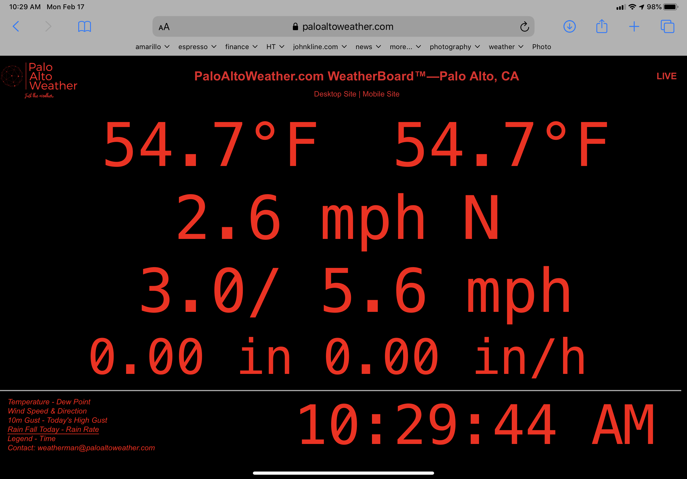

# weewx-weatherboard

WeatherBoard&trade; is a skin for WeeWX inspired by the RainWise LED Weather Oracle display.

It's perfect to display continuously on a low-cost tablet mounted on the wall.

WeatherBoard displays a small set of critical weather information that is easy to read from
across the room.

* Does the wind sound ferocious?
  * Check the WeatherBoard to see how fast it is gusting.

* Is the rain coming down hard?
  * Check the WeatherBoard for the current rate of rainfall and today's total rain.

## Description

Copyright (C)2020-2026 by John A Kline (john@johnkline.com)

**WeatherBoard 3.0 requires LoopData 2.x or later.  It will not work with LoopData 1.x.**

The WeatherBoard&trade; skin provides a simple one page report that shows:
* Current Outside Temperature
* Current Dew Point
* Current Wind Speed and Direction
* 10 Minute High Wind Gust
* Today's High Wind Gust
* Current UV Index
* Current Barometer, with a trend arrow
* Today's Total Rainfall
* 24 Hour Total Rainfall
* Current Rain Rate
* Air Quality Index (if [weewx-purple](https://github.com/chaunceygardiner/weewx-purple) is installed)

The page is generated once per archive interval, but the readings update continuously
in the browser (every 2 seconds by default) from the loop-data.txt file written by the
[weewx-loopdata](https://github.com/chaunceygardiner/weewx-loopdata) extension.  If the
loop data goes stale or cannot be read, the board shows question marks rather than
stale readings.

The inspiration for this skin is the RainWise LED Weather Oracle display.

Following is a screen shot of the WeatherBoard&trade; skin if a PurpleAir sensor is configured.


Following is a screen shot of the WeatherBoard&trade; skin if a PurpleAir sensor is *NOT* configured.



## Requirements

* [WeeWX](https://weewx.com) 4 or 5
* Python 3.7 or later
* [weewx-loopdata](https://github.com/chaunceygardiner/weewx-loopdata) 2.x or later

## Additional Requirements for the Air Quality Index (AQI) Reading
* [weewx-purple](https://github.com/chaunceygardiner/weewx-purple)
* Optionally [purple-proxy](https://github.com/chaunceygardiner/purple-proxy), which
  returns averages over the archive period (as opposed to one shot readings) and
  catches up on AQI readings when WeeWX starts.

# Installation Instructions

1. Install [weewx-loopdata](https://github.com/chaunceygardiner/weewx-loopdata)
   per the installation instructions in the weewx-loopdata README.

1. Make sure the `fields` list in the `[LoopData]` section of `weewx.conf` includes
   the fields WeatherBoard reads:

   ```
   current.dateTime.raw, current.outTemp, current.dewpoint,
   current.windSpeed.formatted, current.windSpeed.raw,
   current.windDir.ordinal_compass, 10m.windGust.max.formatted,
   day.windGust.max, current.UV.formatted, current.barometer,
   current.barometer.formatted, trend.barometer.code,
   day.rain.sum.formatted, 24h.rain.sum.formatted, current.rainRate
   ```

   If `show_purple` is enabled, also include `current.pm2_5_aqi.formatted` and
   `current.pm2_5_aqi_color.raw`.

1. Download the latest release, weewx-weatherboard-3.0.zip, from the
   [GitHub Repository](https://github.com/chaunceygardiner/weewx-weatherboard/releases).

1. Install the extension.

   WeeWX 5:

   `weectl extension install weewx-weatherboard-3.0.zip`

   WeeWX 4:

   `sudo /home/weewx/bin/wee_extension --install weewx-weatherboard-3.0.zip`

   (Adjust the path of wee_extension if WeeWX is installed elsewhere.)

1. The install creates the following section in `weewx.conf`:

   ```
   [[WeatherBoardReport]]
       HTML_ROOT = weatherboard
       enable = true
       skin = WeatherBoard
       [[[Extras]]]
           meta_title = my-weather-website.com Weather at a Glance WeatherBoard&trade;
           title = my-weather-website.com WeatherBoard&trade;
           subtitle = Updated continuously.
           logo = ""
           loop_data_file = loop-data.txt
           expiration_time = 4
           page_update_pwd = foobar
           googleAnalyticsId = ""
           analytics_host = ""
           show_purple = False
           refresh_rate = 2
   ```

1. Edit the `Extras` section to suit your site.
   * `title`, `meta_title`, `subtitle`: your site's branding.
   * `loop_data_file`: where the updater fetches loop data from.  If not a full
     path, it is interpreted as relative to this report's HTML_ROOT.
   * `logo`: path to an image file if your site has a logo.
   * `refresh_rate`: seconds between updates in the browser.  A good choice is
     the rate at which your station's driver emits loop data.
   * `expiration_time`: hours after which the page stops polling (a click on the
     time display restarts it).  To keep a permanently mounted tablet from ever
     timing out, choose your own `page_update_pwd` and open the page as
     `.../index.html?page_update_pwd=yourpassword`.  Note: the password is
     visible in the page source; it is a keep-alive gate, not a secret.
   * `googleAnalyticsId` and, optionally, `analytics_host` if you use Google
     Analytics.
   * `show_purple`: set to `True` if weewx-purple is installed to show the AQI.

1. Restart WeeWX.

## About the missing-data behavior

Every reading is age-checked.  If the loop record is more than 10 seconds old, the
affected readings show question marks of the appropriate width.  If loop-data.txt
cannot be fetched at all, the time display turns blue until the next successful
fetch.  The board never freezes silently on stale data.

## Licensing

weewx-weatherboard is licensed under the GNU Public License v3.
