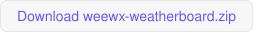
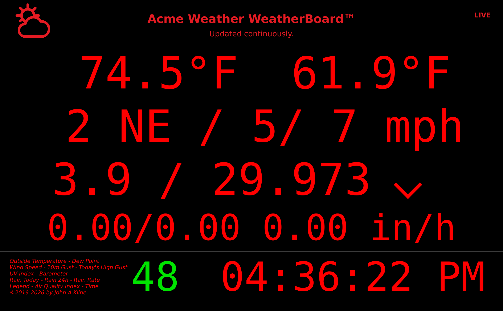
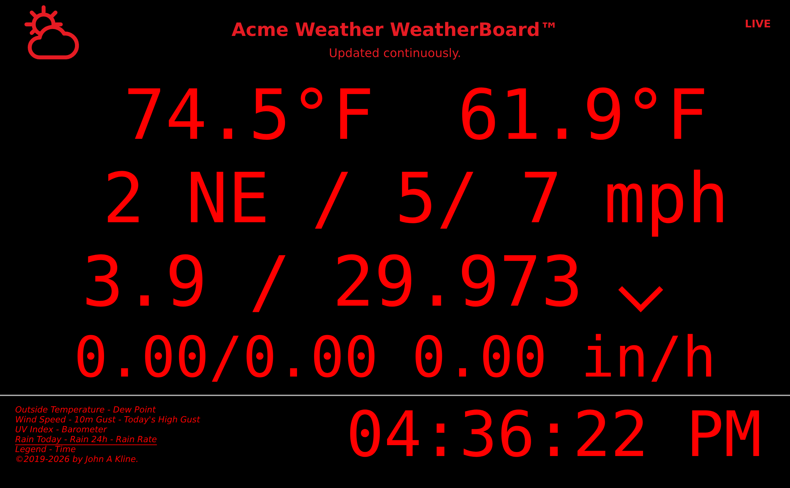

# weewx-weatherboard

[](https://chaunceygardiner.github.io/weewx-weatherboard/)
[](https://github.com/chaunceygardiner/weewx-weatherboard/releases/latest/download/weewx-weatherboard.zip)
[](https://github.com/chaunceygardiner/weewx-weatherboard/issues)

WeatherBoard&trade; is a skin for WeeWX inspired by the RainWise LED Weather Oracle display.

It's perfect to display continuously on a low-cost tablet mounted on the wall.

WeatherBoard displays a small set of critical weather information that is easy to read from
across the room.

* Does the wind sound ferocious?
  * Check the WeatherBoard to see how fast it is gusting.

* Is the rain coming down hard?
  * Check the WeatherBoard for the current rate of rainfall and today's total rain.

## Description

Copyright (C)2020-2026 by John A Kline (john@johnkline.com)

**WeatherBoard 4.1 and later require LoopData 7.0 or later.**

The WeatherBoard&trade; skin provides a simple one page report that shows:
* Current Outside Temperature
* Current Dew Point
* Current Wind Speed and Direction
* 10 Minute High Wind Gust
* Today's High Wind Gust
* Current UV Index
* Current Barometer, with a trend arrow
* Today's Total Rainfall
* 24 Hour Total Rainfall
* Current Rain Rate
* Air Quality Index (if [weewx-purple](https://github.com/chaunceygardiner/weewx-purple) is installed)

The page is generated once per archive interval, but the readings update continuously
in the browser (every 2 seconds by default) from the loop-data.txt file written by the
[weewx-loopdata](https://github.com/chaunceygardiner/weewx-loopdata) extension.  If the
loop data goes stale or cannot be read, the board shows question marks rather than
stale readings.

The inspiration for this skin is the RainWise LED Weather Oracle display.

Following is a screen shot of the WeatherBoard&trade; skin if a PurpleAir sensor is configured.



Following is a screen shot of the WeatherBoard&trade; skin if a PurpleAir sensor is *NOT* configured.



## Requirements

* [WeeWX](https://weewx.com) 4.6 or later (WeeWX 5 recommended)
* Python 3.7 or later
* [weewx-loopdata](https://github.com/chaunceygardiner/weewx-loopdata) 7.0 or later

## Additional Requirements for the Air Quality Index (AQI) Reading
* [weewx-purple](https://github.com/chaunceygardiner/weewx-purple)
* Optionally [purple-proxy](https://github.com/chaunceygardiner/purple-proxy), which
  returns averages over two minutes (as opposed to one shot readings) and
  catches up on AQI readings when WeeWX starts.

## Installation Instructions

1. Install [weewx-loopdata](https://github.com/chaunceygardiner/weewx-loopdata)
   7.0 or later, per the installation instructions in the weewx-loopdata README.
   The WeatherBoard installer refuses to run without it.

1. Download the latest release, weewx-weatherboard.zip, from the
   [GitHub Repository](https://github.com/chaunceygardiner/weewx-weatherboard/releases).

1. Install the extension.

   WeeWX 5, pip install (`weectl` lives in the virtual environment, so
   activate it first; yours may sit elsewhere, `~/weewx-venv` is the usual
   place):

   ```
   source ~/weewx-venv/bin/activate
   weectl extension install weewx-weatherboard.zip
   ```

   WeeWX 5, Debian or Red Hat package install (`weectl` is already on the
   path).  No `sudo`: that install put your account in the `weewx` group,
   which owns the files -- if you installed WeeWX in this same login
   session, log out and back in first so the group membership takes
   effect.

   ```
   weectl extension install weewx-weatherboard.zip
   ```

   WeeWX 4:

   `sudo wee_extension --install weewx-weatherboard.zip`

   (A package install has `wee_extension` on the path, as above.  On a
   setup.py install use the full path, e.g.
   `/home/weewx/bin/wee_extension`.)

1. The skin declares the LoopData fields it reads, in
   `skins/WeatherBoard/skin.conf`, and LoopData writes them into
   `loop-data.txt` under the report's name, in this report's own units and
   formats.  There is nothing to add to `weewx.conf` for this, and the
   installer does not touch the deprecated `[LoopData] [[Include]] fields`
   line; a later LoopData release removes it.  The fields, for reference:

   ```
   current.dateTime.raw, current.dateTime.format("%X"), current.outTemp,
   current.dewpoint, current.windSpeed.formatted, current.windSpeed.raw,
   current.windDir.ordinal_compass, 10m.windGust.max.formatted,
   day.windGust.max, current.UV.formatted, current.barometer.formatted,
   trend.barometer.code, day.rain.sum.formatted, 24h.rain.sum.formatted,
   current.rainRate, current.pm2_5_aqi.formatted, current.pm2_5_aqi_color.raw
   ```

   The last two are the AQI reading, shown with `show_purple` set.  They are
   declared regardless — LoopData omits a field whose observation the station
   does not report — so turning `show_purple` on later needs nothing but the
   setting.  Running purple-proxy needs nothing extra either: the proxy
   averages over two minutes and weewx-purple averages the sensor's two
   channels, so that field already carries the smoothed value.

1. The install creates the following section in `weewx.conf`:

   ```
   [[WeatherBoardReport]]
       HTML_ROOT = weatherboard
       enable = true
       skin = WeatherBoard
       [[[Extras]]]
           meta_title = Acme Weather at a Glance WeatherBoard&trade;
           title = Acme Weather WeatherBoard&trade;
           subtitle = Updated continuously.
           logo = weatherboard_logo.png
           loop_data_file = ../loopdata/loop-data.txt
           #max_age = 10
           #clock_max_age = 120
           #expiration_time = 4
           #refresh_rate = 2
           #show_purple = False
           googleAnalyticsId = ""
           analytics_host = ""
           page_update_pwd = foobar
       [[[Units]]]
           [[[[StringFormats]]]]
               mile_per_hour = %.0f
               degree_C = %.1f
               km_per_hour = %.0f
               degree_F = %.1f
   ```

   Explanatory comments are written above each setting; they are left out
   here for brevity.  The settings with a `#` in front of them are not
   turned off — they are the board's own defaults, written down where you
   can see them, so that a later release can improve a default instead of
   the value being frozen in your `weewx.conf` for ever.  To change one,
   remove the `#` and edit the value.

   Go by what your own file shows rather than by which release you
   installed: a station configured under an earlier release has these
   settings live, with no `#` to remove, and one older still may not have
   them at all — in which case add them inside `[[[Extras]]]`.  All three
   are correct; WeeWX never rewrites a setting that is already there.

1. Edit the `Extras` section to suit your site.
   * `title`, `meta_title`, `subtitle`: your site's branding.  Acme Weather is a
     placeholder; put your own site's name here.
   * `loop_data_file`: where the updater fetches loop data from.  If not a full
     path, it is interpreted as relative to this report's HTML_ROOT.  The
     shipped value is where a stock LoopData writes — its own sample report's
     directory, `loopdata`, beside this one — so with both extensions at their
     defaults it needs nothing.  Pointing it
     at another host needs that server to send `Access-Control-Allow-Origin`, or
     the fetch fails and the board sits permanently disconnected; and even then
     the staleness check described below is weakened, because the `Date` header
     is not readable cross-origin unless that server also sends
     `Access-Control-Expose-Headers: Date`.
   * `logo`: the mark shown at the left of the title bar.  A generic weather icon
     (`weatherboard_logo.png`) ships with the skin; point this at your own logo if
     you have one, or set it to `""` for no mark at all.  The value is a URL as the
     browser sees it, so a bare filename must name a file in this report's
     HTML_ROOT.
   * `refresh_rate`: seconds between updates in the browser.  A good choice is
     the rate at which your station's driver emits loop data.
   * `max_age`: seconds a loop record may be before the readings it feeds show
     question marks instead.  Default 10; raise it for a station that emits
     loop data slowly.
   * `clock_max_age`: seconds the clock in the lower right may fall behind
     before it reads `??:??:??` in the disconnected blue.  Default 120, longer
     than `max_age` on purpose: a stale reading has stopped being true, but a
     clock a few seconds slow is still a good clock.
   * `expiration_time`: hours after which the page stops polling (a click on the
     time display restarts it).  To keep a permanently mounted tablet from ever
     timing out, choose your own `page_update_pwd` and open the page as
     `.../index.html?page_update_pwd=yourpassword`.  Note: the password is
     visible in the page source; it is a keep-alive gate, not a secret.
   * `googleAnalyticsId` and, optionally, `analytics_host` if you use Google
     Analytics.
   * `show_purple`: set to `True` if weewx-purple is installed to show the AQI.

1. Restart WeeWX.  LoopData reads each report's declaration when weewxd
   starts, so until the restart the board's entry is not in `loop-data.txt`
   and the live label reads `NO ENTRY`.

## About the missing-data behavior

Every reading is age-checked.  If the loop record is older than `max_age` seconds
(10 by default), the affected readings show question marks of the appropriate
width.  The time display in the lower right keeps its own, longer threshold,
`clock_max_age` (120 seconds by default), and shows `??:??:??` in blue past it.
If loop-data.txt cannot be fetched at all, the time display turns blue too,
until the next successful fetch, and the readings go on ageing while the
fetch is failing: the board keeps counting from the last age it knew, so
once that passes `max_age` the numbers fall back to question marks as well.
The board never freezes silently on stale data.

That age is measured against the server's clock, not the browser's: it is the
difference between the `Date` header on the loop-data response and the timestamp
written inside the record.  A wall tablet whose own clock is badly wrong therefore
still shows a correct board.  Where no usable `Date` comes back, the board falls
back on how long the record's timestamp has sat unchanged; that fallback can only
understate the age, so it is a backstop rather than a substitute.

## About the time display

The clock in the lower right corner shows the time of the reading currently on
the board, on the *station's* clock.  The string comes from loopdata, rendered
through this report's own WeeWX formatter, so it carries the station's
timezone and time format -- not the tablet's, which on a wall-mounted display
can be another timezone entirely, or simply set wrong.

The format travels with the field name in the skin's declaration:
`current.dateTime.format("%X")`.  `%X` is the station's own time of day format:
`09:44:14 PM` where the station runs a US locale, `21:44:14` under most others.
That locale comes from weewxd's environment (`LANG`), not from a report's
`lang` setting, and a weewxd started with no `LANG` at all -- common in
containers -- falls back to the C locale and renders 24 hour times; setting
`LANG` is the way to change that.  The format cannot be pinned by editing
the declaration: the board looks for the `%X` spelling specifically, so a
different strftime string there does not reformat the clock, it removes the
field the board reads and the corner falls back to `??:??:??`.

The clock ages out too, but on its own threshold: once the loop record is
older than `clock_max_age` seconds it reads `??:??:??` in the disconnected
blue.  That is longer than `max_age` deliberately -- a reading that is
seconds stale has stopped being true, while a clock that is seconds slow is
still worth reading -- so the blue is saved for a time that would mislead
you.

## The manual

Full documentation is at
[chaunceygardiner.github.io/weewx-weatherboard](https://chaunceygardiner.github.io/weewx-weatherboard/):
installation, upgrading, every `Extras` setting, what each reading is, how
staleness is measured, and troubleshooting.

## Licensing

weewx-weatherboard is licensed under the GNU Public License v3.
