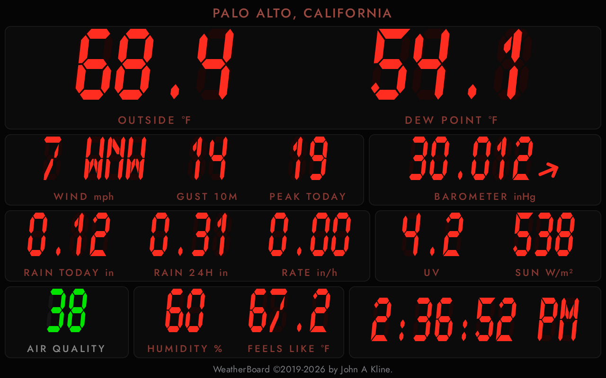

# weewx-weatherboard

[](https://chaunceygardiner.github.io/weewx-weatherboard/)
[](https://github.com/chaunceygardiner/weewx-weatherboard/releases/latest/download/weewx-weatherboard.zip)
[](https://github.com/chaunceygardiner/weewx-weatherboard/issues)

WeatherBoard&trade; is a skin for WeeWX inspired by the RainWise LED Weather Oracle display.

It's perfect to display continuously on a low-cost tablet mounted on the wall.

WeatherBoard displays a small set of critical weather information that is easy to read from
across the room.

* Does the wind sound ferocious?
  * Check the WeatherBoard to see how fast it is gusting.

* Is the rain coming down hard?
  * Check the WeatherBoard for the current rate of rainfall and today's total rain.

## Description

Copyright (C)2020-2026 by John A Kline (john@johnkline.com)

**WeatherBoard 5.0 and later require WeeWX 5.2 or later, and LoopData 7.0 or later.**

The skin makes two pages, and a tablet shows whichever its URL names.

**The LED board**, `index.html`, is a wall of seven-segment digits with
their unlit segments showing:



**The split-flap board**, `splitflap.html`, shows the same station as an
airport departure board, with a lamp at the end of each row that lights
when the row has something to say:


Between them they show, under a one-line title that is the station's
location unless you set your own:
* Outside temperature, dew point, humidity and feels like
* Wind speed and direction, the 10 minute high gust and today's high gust
* Barometer, with an arrow whose angle is its trend
* Today's rainfall, the last 24 hours' rainfall and the rain rate
* UV index and solar radiation, on a station that has them
* Air quality index, on a station that has an air quality sensor
* The station's time, which doubles as the status line

The pages are generated once per archive interval, but the readings update
continuously in the browser (every 2 seconds by default) from the
loop-data.txt file written by the
[weewx-loopdata](https://github.com/chaunceygardiner/weewx-loopdata)
extension.  If the loop data goes stale or cannot be read, the LED board
lights only the middle segment of each digit, the split-flap board turns
to question marks, and the clock says how old the data is or what went
wrong.

The board speaks Danish, Dutch, English, French, German, Italian,
Norwegian, Spanish and Swedish, chosen by the report's `lang` setting like
any other WeeWX skin.

## Requirements

* [WeeWX](https://weewx.com) 5.2 or later
* Python 3.7 or later
* [weewx-loopdata](https://github.com/chaunceygardiner/weewx-loopdata) 7.0 or later
* On the tablet: Safari 14.1 or later (iOS 14.5), Chrome 84 or later, or
  Firefox 75 or later

## Additional Requirements for the Air Quality Index (AQI) Reading
* An air quality sensor, and an extension that computes its index, such as
  [weewx-purple](https://github.com/chaunceygardiner/weewx-purple)
* Optionally [purple-proxy](https://github.com/chaunceygardiner/purple-proxy), which
  returns averages over two minutes (as opposed to one shot readings) and
  catches up on AQI readings when WeeWX starts.

## Installation Instructions

1. Install [weewx-loopdata](https://github.com/chaunceygardiner/weewx-loopdata)
   7.0 or later, per the installation instructions in the weewx-loopdata README.
   The WeatherBoard installer refuses to run without it.

1. Download the latest release, weewx-weatherboard.zip, from the
   [GitHub Repository](https://github.com/chaunceygardiner/weewx-weatherboard/releases).

1. Install the extension.

   WeeWX 5, pip install (`weectl` lives in the virtual environment, so
   activate it first; yours may sit elsewhere, `~/weewx-venv` is the usual
   place):

   ```
   source ~/weewx-venv/bin/activate
   weectl extension install weewx-weatherboard.zip
   ```

   WeeWX 5, Debian or Red Hat package install (`weectl` is already on the
   path).  No `sudo`: that install put your account in the `weewx` group,
   which owns the files -- if you installed WeeWX in this same login
   session, log out and back in first so the group membership takes
   effect.

   ```
   weectl extension install weewx-weatherboard.zip
   ```

1. The skin declares the LoopData fields it reads, in
   `skins/WeatherBoard/skin.conf`, and LoopData writes them into
   `loop-data.txt` under the report's name, in this report's own units and
   formats.  There is nothing to add to `weewx.conf` for this, and the
   installer does not touch the deprecated `[LoopData] [[Include]] fields`
   line; a later LoopData release removes it.  The fields, for reference:

   ```
   current.dateTime.raw, current.dateTime.format("%H:%M:%S"),
   current.outTemp.formatted, current.dewpoint.formatted,
   current.appTemp.formatted, current.outHumidity.formatted,
   day.outTemp.max.formatted, current.windSpeed.formatted,
   current.windDir.ordinal_compass, 10m.windGust.max.formatted,
   day.windGust.max.formatted, 10m.windSpeed.max.formatted,
   day.windSpeed.max.formatted, current.barometer.formatted,
   trend.barometer.code, day.rain.sum.formatted, 24h.rain.sum.formatted,
   current.rainRate.formatted, current.UV.formatted,
   current.radiation.formatted, current.pm2_5_aqi.formatted,
   current.pm2_5_aqi_color.raw
   ```

   The optional readings' fields are declared regardless — LoopData omits a
   field whose observation the station does not report — so a sensor added
   later needs nothing but a restart.

1. The install creates the following section in `weewx.conf`:

   ```
   [[WeatherBoardReport]]
       HTML_ROOT = weatherboard
       enable = true
       skin = WeatherBoard
       [[[Extras]]]
           loop_data_file = ../loopdata/loop-data.txt
           #max_age = 10
           #expiration_time = 4
           #refresh_rate = 2
           #show_uv = auto
           #show_radiation = auto
           #show_aqi = auto
           googleAnalyticsId = ""
           analytics_host = ""
           page_update_pwd = foobar
       [[[Units]]]
           [[[[StringFormats]]]]
               mile_per_hour = %.0f
               degree_C = %.1f
               km_per_hour = %.0f
               degree_F = %.1f
   ```

   Explanatory comments are written above each setting; they are left out
   here for brevity.  The settings with a `#` in front of them are not
   turned off — they are the board's own defaults, written down where you
   can see them, so that a later release can improve a default instead of
   the value being frozen in your `weewx.conf` for ever.  To change one,
   remove the `#` and edit the value.

   Go by what your own file shows rather than by which release you
   installed: a station configured under an earlier release has some of
   these settings live, with no `#` to remove, and may not have the newer
   ones at all — in which case add them inside `[[[Extras]]]`.  All three
   are correct; WeeWX never rewrites a setting that is already there.

1. Edit the `Extras` section to suit your site.
   * `title`: the line across the top of the boards.  Without it they show
     the station's location, from `[Station]`; add it to show your site's
     name.  `meta_title` sets the browser tab's title the same way, and
     defaults to the title.
   * `loop_data_file`: where the pages fetch loop data from.  If not a full
     path, it is interpreted as relative to this report's HTML_ROOT.  The
     shipped value is where a stock LoopData writes — its own sample report's
     directory, `loopdata`, beside this one — so with both extensions at their
     defaults it needs nothing.  Pointing it
     at another host needs that server to send `Access-Control-Allow-Origin`, or
     every fetch fails and the clock reads `NO CONNECT`; and even then
     the staleness check described below is weakened, because the `Date` header
     is not readable cross-origin unless that server also sends
     `Access-Control-Expose-Headers: Date`.
   * `refresh_rate`: seconds between updates in the browser.  A good choice is
     the rate at which your station's driver emits loop data.
   * `max_age`: seconds a loop record may be before the readings it feeds are
     shown as missing and the clock gives way to the data's age.  Default 10;
     raise it for a station that emits loop data slowly.
   * `expiration_time`: hours after which the page stops polling and says
     `EXPIRED TAP`; a tap anywhere starts it again.  To keep a permanently
     mounted tablet from ever timing out, choose your own `page_update_pwd`
     and open the page as `.../index.html?page_update_pwd=yourpassword` (or
     `splitflap.html?...`).  Note: the password is visible in the page
     source; it is a keep-alive gate, not a secret.
   * `show_uv`, `show_radiation`, `show_aqi`: `auto`, the default, shows a
     reading when the station's current record carries it; `true` or
     `false` forces it.  `show_purple`, from earlier releases, is still
     honored while `show_aqi` is `auto`.
   * `clock_format`: `12` or `24`.  Left unset, English shows a 12 hour
     clock and the other languages a 24 hour one.
   * `googleAnalyticsId` and, optionally, `analytics_host` if you use Google
     Analytics.

1. Restart WeeWX.  LoopData reads each report's declaration when weewxd
   starts, so until the restart the board's entry is not in `loop-data.txt`
   and the clock reads `NO ENTRY`.

## About the missing-data behavior

Every reading is age-checked.  If the loop record is older than `max_age`
seconds (10 by default), every reading is shown as missing, the way each
display would show it: the LED board lights only the middle segment of
each digit and leaves its decimal point dark, and the split-flap board
turns each digit to a question mark.  The clock, at the same moment, gives
way to the data's age — `47 S AGO` — in amber for the first minute and red
after that.  If loop-data.txt cannot be fetched or used, the clock names the
failure instead (`HTTP 404`, `BAD DATA`, `NO ENTRY`, `BAD URL`,
`NO CONNECT` for a network failure, or `NO CLOCK` for a record with no
usable timestamp), and the readings go on aging while
the fetch is failing: the board keeps counting from the last age it knew,
so once that passes `max_age` the numbers are shown as missing as well.
The board never freezes silently on stale data.

That age is measured against the server's clock, not the browser's: it is the
difference between the `Date` header on the loop-data response and the timestamp
written inside the record.  A wall tablet whose own clock is badly wrong therefore
still shows a correct board.  Where no usable `Date` comes back, the board falls
back on how long the record's timestamp has sat unchanged; that fallback can only
understate the age, so it is a backstop rather than a substitute.

## About the time display

The clock shows the time of the reading currently on the board, on the
*station's* clock.  It comes from loopdata as
`current.dateTime.format("%H:%M:%S")`, rendered through this report's own
WeeWX formatter, so it carries the station's timezone -- not the tablet's,
which on a wall-mounted display can be another timezone entirely, or simply
set wrong.  The board lays it out as a 12 or 24 hour clock itself, by
`clock_format` or the report's language.

## The manual

Full documentation is at
[chaunceygardiner.github.io/weewx-weatherboard](https://chaunceygardiner.github.io/weewx-weatherboard/):
installation, upgrading, every `Extras` setting, what each reading is, how
staleness is measured, and troubleshooting.

## Licensing

weewx-weatherboard is licensed under the GNU Public License v3.

The LED board's lettering is the LCDMono2 Ultra font, Copyright 1999 by
Samuel Reynolds (http://www.spinwardstars.com/scrfonts/), distributed
under the terms in `skins/WeatherBoard/fonts/lcdmono2ultra/LICENSE.TXT`.
The split-flap board's lettering is Jost, Copyright 2020 The Jost Project
Authors, under the SIL Open Font License in
`skins/WeatherBoard/fonts/jost/license.txt`.
