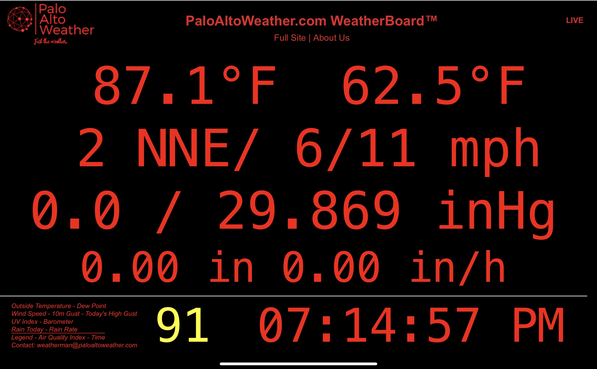
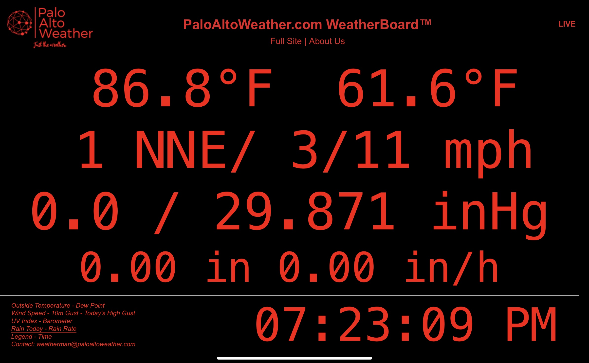

# weewx-weatherboard
WeatherBoard&trade; is a skin for WeeWX inspired by the RainWise LED Weather Oracle display

## Description

Copyright (C)2020 by John A Kline (john@johnkline.com)

The WeatherBoard&trade; sking provides a simple one page skin that shows:
* Current Outside Temperature
* Current Dew Point
* Current Wind Speed and Direction
* 10 Minute High Wind Gust
* Today's High Wind Gust
* Today's Total Rainfall
* Current Rain Rate
* Air Quality Indicator (If [weewx-purple](https://github.com/chaunceygardiner/weewx-purple) is installed.)

The inspiration for this skin is the RainWise LED Weather Oracle display.

Following is a screen shot of the WeatherBoard&trade; skin if a PurpleAir sensor is configured.



Following is a screen shot of the WeatherBoard&trade; skin if a PurpleAir sensor is *NOT* configured.



## Additional Requirements
* [WeeWX 4.x](https://github.com/weewx/weewx) (Currently in beta.)
* [weewx-loopdata](https://github.com/chaunceygardiner/weewx-loopdata)
* Python 3 (because weewx-loopdata requires Python 3).

## Additional Requirements for Air Quality Indictator (AQI) Readings on the Report
* [weewx-purple](https://github.com/chaunceygardiner/weewx-purple)

## Additional Requirements to Display AQI Averages over the Report Interval and to Catchup on AQI Readings when WeeWX Starts
* [purple-proxy](https://github.com/chaunceygardiner/purple-proxy)

# Installation Instructions

1. Install [weewx-loopdata](https://github.com/chaunceygardiner/weewx-loopdata).

1. Edit weewx.conf, in the `[[LoopData]]` section:
   1. Set the `target_report` to `WeatherBoardReport`

      `target_report = WeatherBoardReport`

   1. In the  LoopData section of weewx.conf, add the following fields if they
   are not already listed (these are the fields needed for the WeatherBoard&trade; skin):

       * `dateTime`
       * `COMPASS_windDir`
       * `FMT_day_rain_total`
       * `FMT_dewpoint`
       * `FMT_outTemp`
       * `FMT_rainRate`
       * `FMT_windSpeed`
       * `FMT_HI_windGust`
       * `FMT_10mMaxGust`
       * `windSpeed`
       * `pm2_5_aqi`  <- If PurpleAir sensor and weewx-purple-proxy installed.
       * `pm2_5_aqic` <- If PurpleAir sensor and weewx-purple-proxy installed.

1. If the installation has a PurpleAir sensor, install [weewx-purple](https://github.com/chaunceygardiner/weewx-purple).

1. If the installation has a PurpleAir sensor, to display AQI Averages over the report
   interval and to catchup on AQI Readings when WeeWX starts, optionally install
   [purple-proxy](https://github.com/chaunceygardiner/purple-proxy).

1. Install this skin:

   1. cd to the directory where this extension was downloaded.

      `cd ~/software/weewx-weatherboard`

   1. Execute the following command:
       `sudo /home/weewx/bin/wee_extension --install .`

       (Assumes WeeWX is installed at /home/weewx.  Adjust accordingly.)

1. The install creates the following section in `weewx.conf`.

```
    [[WeatherBoardReport]]
        HTML_ROOT = public_html/weatherboard
        enable = true
        skin = WeatherBoard
        [[[Extras]]]
            loop_data_file = ../loop-data.txt
            contact_email = john@doe.com
            page_update_pwd = foo
            googleAnalyticsId = ""
            analytics_host = ""
            show_purple = None
            expiration_time = 4
            archive_interval = 300
            delay = 20
        [[[Units]]]
            [[[[StringFormats]]]]
                mile_per_hour = %.1f
                degree_C = %.1f
                km_per_hour = %.1f
                degree_F = %.1f
```

1. Edit the `Extras` section of the `WeatherBoard` section of `weewx.conf`.
   Update the `loop_data_file`, `contact_email` and `page_udpate_pwd` as to
   appropriate values.  (Note: the `page_update_pwd` is used on the URL in order
   to keep WeatherBoard from timing out.

1. If you with to wire up Google Analytics, fill in `googleAnalyticsId` and, optionally,
   `analytics_host`.

1. If a PurpleAir air quality sensor is installed and the
   [weewx-purple](https://github.com/chaunceygardiner/weewx-purple)
   extension is installed, change `show_purple` in the `Extras`
   section to `Indoor` for a PurpleAir indoor sensor or `Outdoor` for
   a PurpleAir outdoor sensor.  Also, fill in `archive_interval` to
   match WeeWX's archive interval.  The default for the `delay` field
   should be fine.

1. Restart WeeWx


## Licensing

weewx-loopdata is licensed under the GNU Public License v3.
