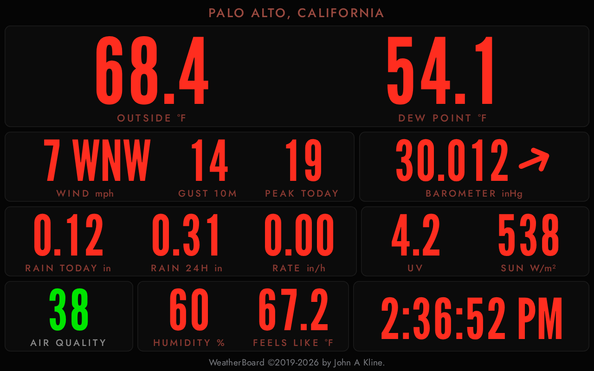
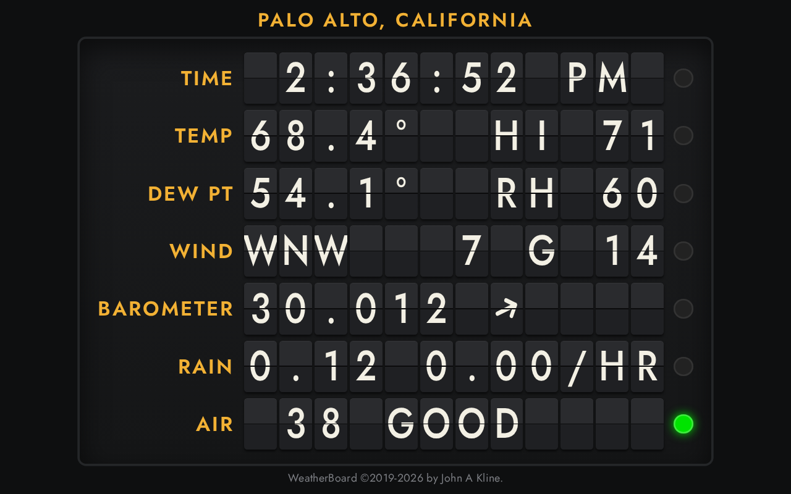
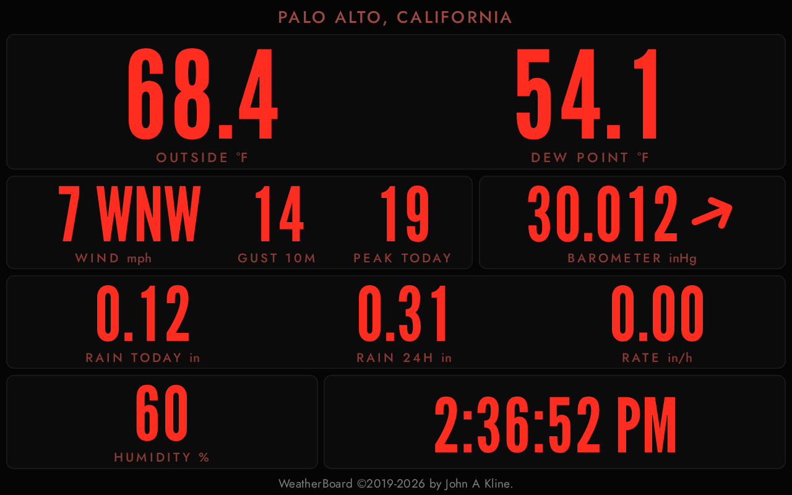
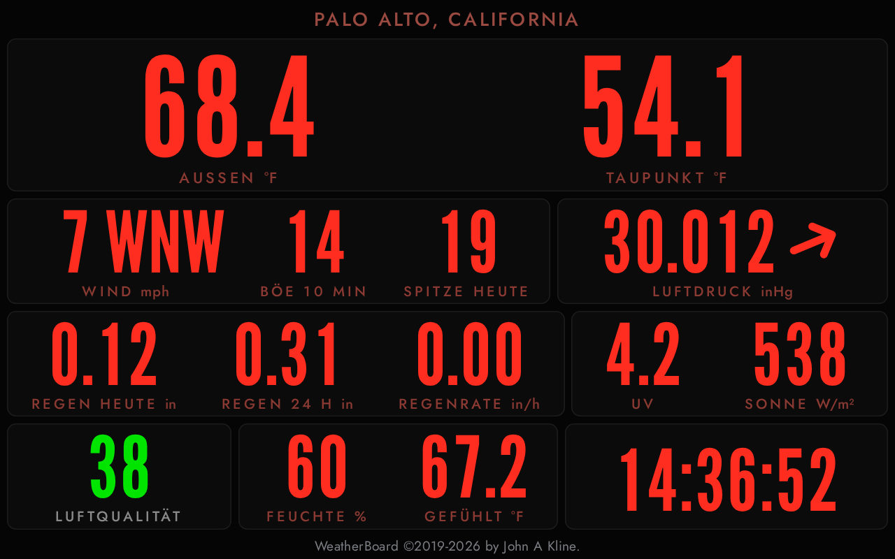

# WeeWX WeatherBoard — the weather at a glance

[View on GitHub](https://github.com/chaunceygardiner/weewx-weatherboard){: .btn .btn-primary }
[Download weewx-weatherboard.zip](https://github.com/chaunceygardiner/weewx-weatherboard/releases/latest/download/weewx-weatherboard.zip){: .btn }
[Report an issue](https://github.com/chaunceygardiner/weewx-weatherboard/issues){: .btn }

WeatherBoard&trade; is a WeeWX skin inspired by the RainWise LED Weather
Oracle: the current weather in characters large enough to read from
across the room.  It is meant to run full screen on a low-cost tablet
mounted on the wall, and it never needs a reload — the numbers change every
couple of seconds.

Does the wind sound ferocious?  Look up and see how fast it is gusting.  Is
the rain coming down hard?  The rate and today's total are already on the
wall.

The skin makes two pages of the same station, and a tablet shows whichever
its URL names.  **The readout board**, `index.html`, is a wall of tall
figures in panels:

**The split-flap board**, `splitflap.html`, is an airport departure
board, its flaps turning as the readings change, with a lamp at the end
of each row that lights when the row has something to say:

**Requirements:** WeeWX 5.2 or later, Python 3.7 or later, and
[weewx-loopdata](https://github.com/chaunceygardiner/weewx-loopdata) 7.0 or
later.  The air quality reading additionally needs an air quality sensor
and an extension that computes its index, such as
[weewx-purple](https://github.com/chaunceygardiner/weewx-purple).

## What is on the boards

* A one-line title: the station's location, or your own
  [`title`](configuration.html#title)
* Outside temperature and dew point
* Humidity, and feels like (on the readout board; the split-flap board shows
  humidity and today's high on its temperature rows)
* Wind speed and direction, the ten-minute high gust, and today's high
  gust (the split-flap board shows the ten-minute gust)
* Barometer, with an arrow whose angle is its trend
* Rain today, rain in the last 24 hours, and the rain rate (the split-flap
  board shows today's and the rate)
* UV index and solar radiation, on a station that has them (readout board)
* Air quality index, on a station with an air quality sensor
* The station's time, which is also the status line

UV, solar radiation and air quality show only on a station that has
them, and the board closes up around what is missing:

## How it stays live

The pages themselves are ordinary WeeWX output: CheetahGenerator writes
them once per archive interval.  The *readings* do not wait for that.
Javascript in each page polls the `loop-data.txt` file written by
[weewx-loopdata](https://github.com/chaunceygardiner/weewx-loopdata)
— by default every two seconds, which is about as often as a typical
station emits a loop packet — and rewrites the numbers in place.

That makes LoopData a hard requirement rather than a nicety: the board
displays what LoopData puts in that file.  The skin declares the fields it
reads, and LoopData writes them under the report's name in the report's
own units and formats, so an ordinary install has nothing to edit.  See
[Installation](installation.html).

Everything on the board is age-checked.  If the loop data stops advancing —
or stops arriving at all — every reading is shown as missing, and the
clock says how old the data is or what went
wrong, rather than showing you a number that stopped being true ten minutes
ago.  See [When data goes missing](missing-data.html).

## In your language

The board speaks Danish, Dutch, English, French, German, Italian,
Norwegian, Spanish and Swedish, chosen by the report's `lang` setting like
any other WeeWX skin:

## Where to go next

* [Installation](installation.html) — install LoopData, install the skin,
  restart, and keep the tablet awake.
* [Upgrading](upgrading.html) — what each release needs from you, newest
  first.
* [Configuration](configuration.html) — every `[Extras]` setting, what it
  does, and what it defaults to, and the board's language.
* [Reading the board](reading-the-board.html) — what each reading is, the
  barometer's arrow, the split-flap lamps, and the status line.
* [When data goes missing](missing-data.html) — what missing data looks
  like, and how staleness is measured.
* [Troubleshooting](troubleshooting.html) — symptoms, in the order they
  turn up.
