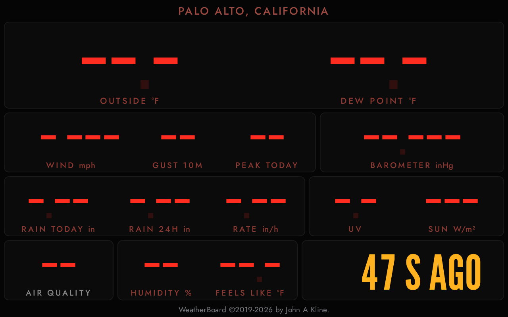

# When data goes missing

[weewx-weatherboard manual](https://chaunceygardiner.github.io/weewx-weatherboard/) · [weewx-weatherboard on GitHub](https://github.com/chaunceygardiner/weewx-weatherboard) · [Report an issue](https://github.com/chaunceygardiner/weewx-weatherboard/issues)

---

A board on the wall is read at a glance, and a glance cannot tell a live
number from one that froze an hour ago.  So the board would rather show
nothing than show something stale: every reading is checked for both age
and existence on every poll, and anything that fails is shown as missing,
in the shape of the number it replaces.

## The staleness rule

If the loop record is older than [`max_age`](configuration.html#max_age)
seconds — ten by default — every reading is shown as missing, the way
each display would show it:

* **The readout board** shows a dash for each digit, and dims the
  decimal point.  A temperature reads `--.-` with a faint dot where the
  point was; the barometer `--.---`; the wind direction `---`.  Each
  placeholder is exactly as wide as the reading it stands for.
* **The split-flap board** turns each digit to a question mark and leaves
  a blank flap where the decimal point was: `?? ?°`, `?? ???`,
  `? ?? ? ??/HR`.

At the same moment the clock gives way to the data's age: `47 S AGO` in
amber for the first minute, then `7 M AGO` and on in red.  The status line
and the readings share the one threshold, so a board never shows a live
clock over missing readings, or a stale age over live ones.

The board itself keeps working the whole time.  A reading whose field is
missing from `loop-data.txt` — an observation your station does not
report, which LoopData omits — is shown as missing by itself; everything
else goes on updating.

## How age is measured

Age is the difference between two absolute times: the timestamp inside the
loop record, written by the WeeWX station, and the `Date` header on the
HTTP response that carried it, stamped by whatever web server answered.
The browser's own clock is deliberately not consulted.  A wall-mounted
tablet's clock can be badly wrong, and since this one number gates every
reading, a skewed clock would blank the entire board.

When a cache sits in the middle it preserves the origin's `Date` and adds
an `Age` header; the board adds that back, so a cached response cannot
report itself as younger than it is.

Two further defenses:

* **A unique URL per poll.**  `loop-data.txt` ships without cache headers,
  so browsers fall back on heuristic freshness — and that window widens as
  the file gets older, which is exactly when a cached copy would claim to
  be live.
* **A revalidation request, same-origin only.**  `Cache-Control` is not a
  CORS-safelisted header, so sending it to another host would turn every
  poll into a preflighted request, and a plain file server answering
  `OPTIONS` with 405 would leave the board permanently disconnected.

If no usable `Date` comes back — the common case is a cross-origin
`loop_data_file` whose server does not send
`Access-Control-Expose-Headers: Date` — the board falls back on how long
the record's own timestamp has sat unchanged.  That elapsed time is always
a *lower* bound on the true age, so it can only understate it: a backstop,
not a substitute.

## Losing the file entirely

When the fetch fails outright, the clock names the failure — see
[the status line](reading-the-board.html#the-status-line):

* An HTTP error status shows the status, `HTTP 404`.  A persistent 404
  nearly always means `loop_data_file` does not resolve to where LoopData
  writes — the classic being a file in `/dev/shm` with nothing serving it.
* A response that is not json shows `BAD DATA`: something is being served
  at that URL, but it is not LoopData's output.
* LoopData's json with no entry for this report shows `NO ENTRY`.
  LoopData reads each report's declaration when weewxd starts, so this is
  what a freshly installed or upgraded board shows until the restart — see
  [Troubleshooting](troubleshooting.html#the-clock-reads-no-entry).
* A `loop_data_file` that is not a usable URL shows `BAD URL`.  Nothing
  was ever sent: the browser rejected the address itself.
* A network-level failure — the server gone, the wifi dropped, a request
  that timed out — shows `NO CONNECT`.

The readings go on aging throughout.  A failed poll brings no new data, so
the board keeps counting from the last age it knew: once that reaches
[`max_age`](configuration.html#max_age) every reading is shown as
missing, exactly as it would be if the file were still being served but
had stopped advancing.  A dropped poll or two never blanks a board whose
data is fresh — at a two second refresh the arithmetic has not reached
`max_age` yet — but an outage that outlasts the threshold will, and that
is the point: a ten-minute-old temperature is indistinguishable from a
live one at a glance.

Polling never stops for any of this.  When the data comes back, so does the
board.
